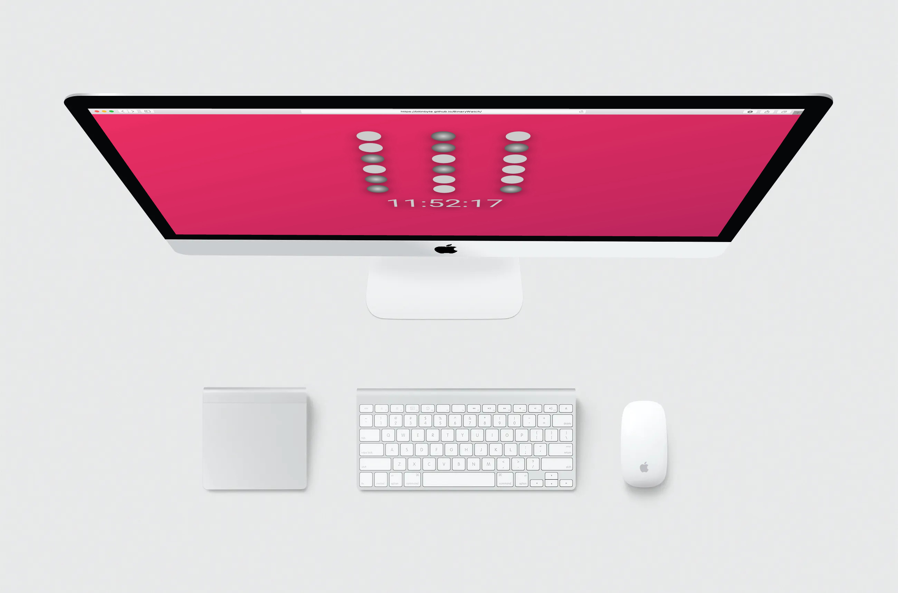

# Binary Clock  
## [Check it here](https://bitinbyte.github.io/BinaryWatch/)

Thumbnail of the Binary Clock web app 
## Intro
Basic project made in hollidays without internet. This project was a challenge to myself to perform a small product without using the internet to search for something.   
### Installing
  
The project can be cloned and there's two steps to test the project and can be tested by yourself, with all of the changes that you want to do!  
  
Step 1: Run the next script to create a live local server and build in dev mode in real time  

```
npm run start  
```
  
Step 2: Buil the project to be ready for production

```
npm run build:css  
```
  
The commands above need to be introduced on the root folder of the project.    
  
## Specifications  
This project doesn't add nothing to my knowledge but this project was a challenge for me, I was in hollidays, boring and without internet, so why not, test everything that I already learned in a really small project?  
## Built With
- HTML
- CSS3
- SASS  
- Vanilla JavaScript
## Contributing
Feel free to download it and improve it. If you want just give a pull request with your changes and let me know what can be improved. Many thanks :D
## Pages
- [GitHub Page](https://github.com/BitInByte)
- [Instagram](https://www.instagram.com/bitinbyte/)
- [Twitter](https://twitter.com/BitInByte2)
## Authors
**BitInByte** - Development student and tech enthusiastic

